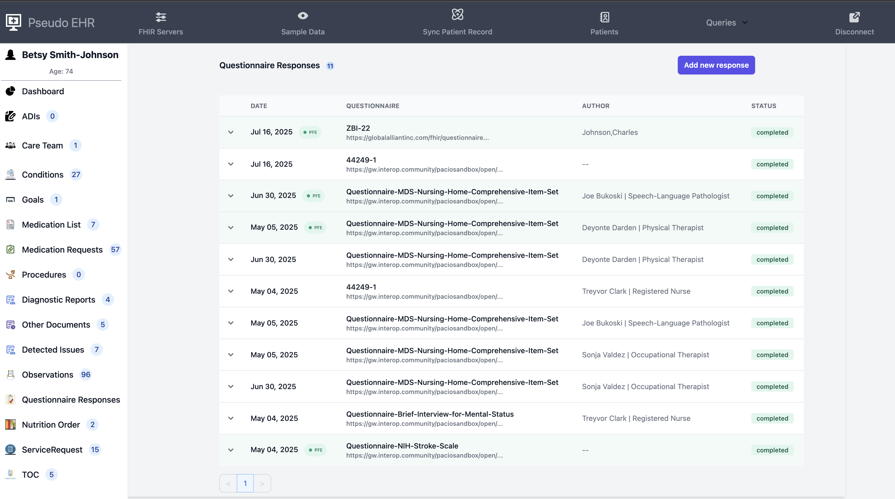
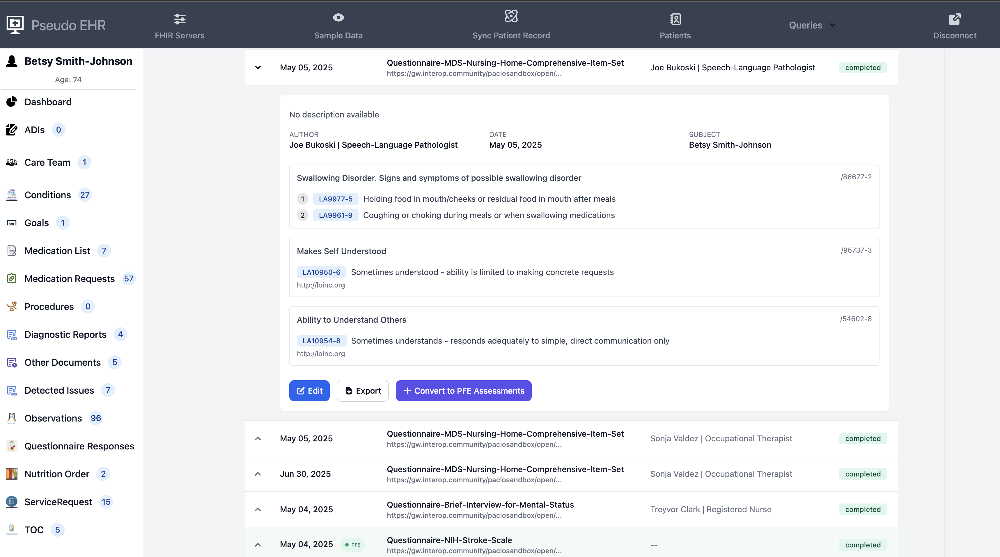
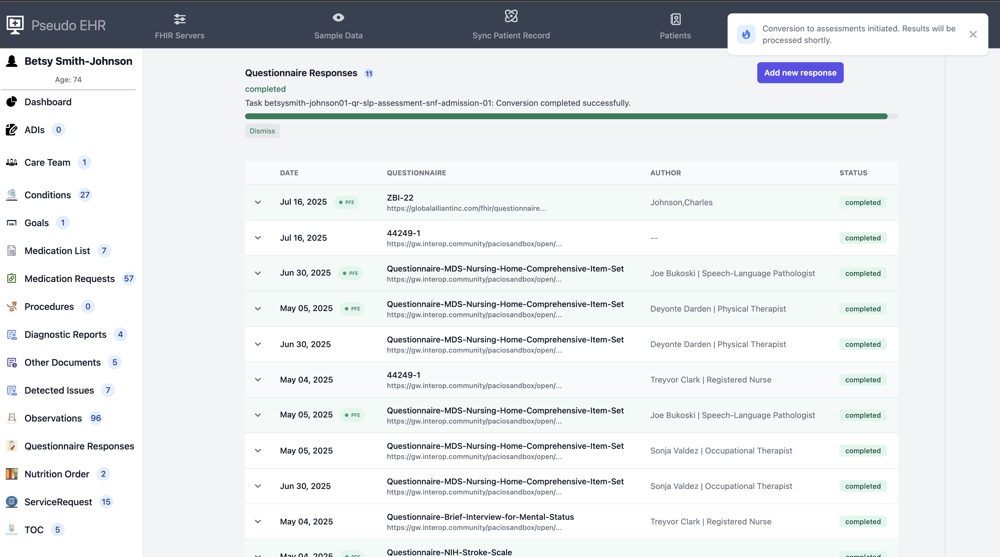
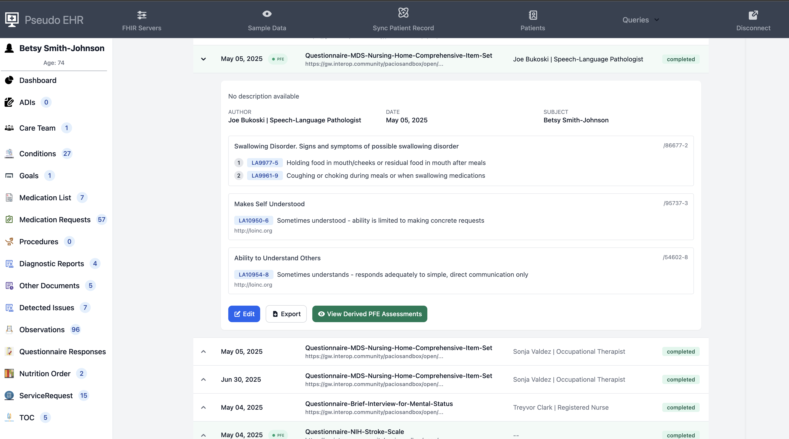
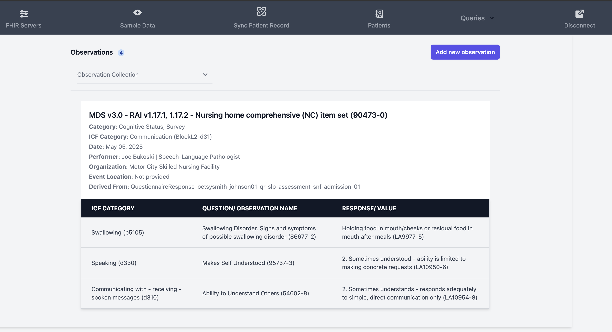

# PSEUDO-EHR

A Rails 7 application styled with Tailwind CSS that interacts with a FHIR server to fetch and display patient information.

**PseudoEHR** is a reference implementation client application for the [PACIO Project](https://pacioproject.org/) use cases. It supports the following PACIO Implementation Guides:

* [**PACIO Advance Directive Interoperability (ADI)**](https://build.fhir.org/ig/HL7/fhir-pacio-adi/branches/master/index.html)
* [**PACIO Personal Functioning and Engagement (PFE)**](https://build.fhir.org/ig/HL7/fhir-pacio-pfe/index.html)
* [**PACIO Transitions of Care (TOC)**](https://paciowg.github.io/transitions-of-care-fsh/index.html)
* [**Standardized Medication Profile (SMP)**](https://build.fhir.org/ig/HL7/smp-ig/index.html)

## Table of Contents

* [Features](#features)
* [Supported FHIR Resources](#supported-fhir-resources)
* [Prerequisites](#prerequisites)
* [Technologies Used](#technologies-used)
* [Installation](#installation)
* [Docker Compose Deployment](#docker-compose-deployment)
* [Usage](#usage)
* [Application Structure](#application-structure)
* [Testing](#testing)
* [Common Commands](#common-commands)
* [Contributing](#contributing)
* [License](#license)

## Features

* **FHIR Server Integration**: Connects to FHIR servers to fetch and cache patient details.
* **Patient Display**: Shows a list of patients and individual patient details.
* **Server Authentication**: Handles FHIR servers that require [SMART-on-FHIR App Launch for Symmetric Client Auth](https://build.fhir.org/ig/HL7/smart-app-launch/example-app-launch-symmetric-auth.html#step-2-launch).
* **Sample Data Management**: Browse and view sample FHIR resources organized by use case and scene, and load them into FHIR servers.
* **QuestionnaireResponse Transformation**: Convert QuestionnaireResponse into PFE Observation Bundles.

## Supported FHIR Resources

The application is able to query (read/search) and display the following FHIR resources:


* **CareTeam**
* **Composition**
* **Condition**
* **DetectedIssue**
* **DiagnosticReport**
* **DocumentReference**
* **Goal**
* **List** (Medication)
* **Location**
* **MedicationRequest**
* **NutritionOrder**
* **Observation**
* **Organization**
* **Patient**
* **PractitionerRole**
* **Procedure**
* **QuestionnaireResponse**
* **ServiceRequest**

All searches are performed using the `_include=*` parameter to retrieve and include related resources.

## Prerequisites

* Ruby version 3.3.6
* Rails 7
* PostgreSQL

## Technologies Used

* **Ruby on Rails 7**: The main web framework.
* **Turbo**: Part of the Hotwire stack used for making real-time page updates without needing JavaScript.
* **Stimulus**: A JavaScript framework that augments HTML with behavior using simple, declarative attributes.
* **Tailwind CSS**: Used for styling the UI.
* **FHIR Integration**: For interacting with FHIR servers, focusing on patient data.
* **PostgreSQL**: The relational database used.
* **RSpec**: Testing framework for unit and feature tests.

## Installation

Make sure to start PostgreSQL before running the server.

1. **Clone the Repository**

   ```bash
    git clone https://github.com/paciowg/pseudo-ehr.git
    cd pseudo-ehr
   ```

2. **Install Dependencies**

   ```bash
    yarn install
    bundle install
   ```

Note: Building tailwind may require BUNDLE_FORCE_RUBY_PLATFORM to be unset, see [https://github.com/flavorjones/tailwindcss-ruby#check-bundle_force_ruby_platform](https://github.com/flavorjones/tailwindcss-ruby#check-bundle_force_ruby_platform).

3. **Database Setup**

   ```bash
     bundle exec rails db:create
     bundle exec rails db:migrate
     bundle exec rails db:seed
   ```

   > > **Note**: This should only be executed the first time you clone this repository.
   > > `rails db:seed` will persist the default servers commonly used in PACIO
   > > tracks and this app has been tested against


## Docker Compose Deployment

This application can be deployed using Docker Compose for a simple setup.

1.  **Environment Setup**

    You need a `SECRET_KEY_BASE` for Rails to run in production. You can generate a key with Rails:

    ```bash
    bundle exec rails secret
    ```

    Your `.env` file (create one if needed) should contain the generated secret key and a password for the database:

    ```text
    # .env
    SECRET_KEY_BASE=your_generated_secret_key_here
    POSTGRES_PASSWORD=your_secure_password
    ```

2.  **Build and Start Services**

    Build the Docker image and start the application and database services:

    ```bash
    docker compose up --build -d
    ```

3.  **Database Setup**

    With the services running, set up the database. This command runs inside the application container.

    ```bash
    docker compose run --rm app rails db:setup
    ```

    This will create, migrate, and seed the database.

4.  **Accessing the Application**

    The application will be available at `http://localhost`. (It maps to port 80 on your host).

5.  **Managing the Services**

    *   To view the application logs:
        ```bash
        docker compose logs -f app
        ```
    *   To stop the services:
        ```bash
        docker compose down
        ```

## Usage

1. **Starting the Server**

   ```bash
     ./bin/dev
   ```

   Open your browser and navigate to `http://localhost:3000`.

2. **Connecting to a FHIR Server**

   * Navigate to the root path.
   * Select a FHIR server from the list of saved servers or enter your FHIR server details and connect.
   * Once connected, you can view a list of patients or see details of a specific patient.

This app has been tested with the following FHIR servers:

| Server Name                                 | Base URL                                  | Tested IGs    |
| ------------------------------------------- | ----------------------------------------- | ------------- |
| PACIO Sandbox | `https://gw.interop.community/paciosandbox/open` | PFE, SMP, TOC |
| Michigan Health Information Network (MiHIN) | `https://gw.interop.community/MiHIN/open` | PFE, SMP, TOC |
| MaxMD FHIR Server                           | `https://qa-rr-fhir2.maxmddirect.com`     | ADI           |

## Application Structure

The Pseudo-EHR application follows the standard Rails structure with a few custom directories:

* **app/**: Contains the core logic of the app including models, views, controllers, and services.

  * **controllers/**: Handles the request-response cycle.
  * **models/**: Contains business logic and data manipulation methods.
  * **views/**: Templates for rendering HTML responses.
  * **services/**: Custom service classes for managing FHIR integration and other core functionalities.
* **config/**: Configuration files for the Rails application, including routes, initializers, and environment settings.
* **db/**: Manages the database schema, migrations, and seeds.
* **lib/**: Contains custom libraries and modules used throughout the app.
* **spec/**: RSpec tests for unit and integration testing.
* **public/**: Static assets and compiled files.

## API Endpoints

### QuestionnaireResponse Processing API

The application provides an API endpoint for processing QuestionnaireResponses and converting them to PFE Observations.

**Endpoint**: `POST /api/convert_qr_to_pfe_and_submit`

**Description**: Processes a FHIR QuestionnaireResponse resource, converts it into PFE Observations according to the PACIO PFE Implementation Guide, and submits the results to a specified FHIR server.

**Parameters**:
- `questionnaire_response`: A FHIR QuestionnaireResponse resource (required)
- `fhir_server`: The base URL of the FHIR server to submit the results to (required)

**Response**:
- Success (200 OK): Returns the FHIR transaction bundle containing the created resources
- Error (400 Bad Request): Returns an error message if the parameters are invalid
- Error (422 Unprocessable Entity): Returns an error message if the conversion or submission fails

**Example Request**:
```json
{
  "questionnaire_response": {
    "resourceType": "QuestionnaireResponse",
    "id": "example-qr",
    "status": "completed",
    "subject": {
      "reference": "Patient/example"
    },
    "questionnaire": "http://example.org/Questionnaire/example",
    "item": [
      {
        "linkId": "1",
        "text": "Example question",
        "answer": [
          {
            "valueString": "Example answer"
          }
        ]
      }
    ]
  },
  "fhir_server": "https://example.org/fhir"
}
```

**Example Success Response**:
```json
{
  "success?": true,
  "code": 200,
  "resource": {
    "resourceType": "Bundle",
    "type": "transaction",
    "entry": [
      {
        "resource": {
          "resourceType": "QuestionnaireResponse",
          "id": "example-qr",
          "status": "completed",
          "subject": {
            "reference": "Patient/example"
          },
          "questionnaire": "http://example.org/Questionnaire/example",
          "item": [
            {
              "linkId": "1",
              "text": "Example question",
              "answer": [
                {
                  "valueString": "Example answer"
                }
              ]
            }
          ]
        },
        "request": {
          "method": "PUT",
          "url": "QuestionnaireResponse/example-qr"
        }
      },
      {
        "resource": {
          "resourceType": "Observation",
          "id": "example-qr-1",
          "status": "final",
          "category": [
            {
              "coding": [
                {
                  "system": "http://hl7.org/fhir/us/pacio-pfe/CodeSystem/pfe-survey-category-cs",
                  "code": "survey"
                }
              ]
            },
            {
              "coding": [
                {
                  "system": "http://hl7.org/fhir/us/core/CodeSystem/us-core-category",
                  "code": "functional-status",
                  "display": "Functional Status"
                }
              ]
            }
          ],
          "code": {
            "coding": [
              {
                "system": "http://loinc.org",
                "code": "1",
                "display": "Example question"
              }
            ]
          },
          "subject": {
            "reference": "Patient/example"
          },
          "valueString": "Example answer",
          "derivedFrom": [
            {
              "reference": "QuestionnaireResponse/example-qr"
            }
          ]
        },
        "request": {
          "method": "PUT",
          "url": "Observation/example-qr-1"
        }
      }
    ]
  }
}

```

## QuestionnaireResponse to PFE Conversion

The application provides functionality to convert FHIR QuestionnaireResponse resources into PACIO Personal Functioning and Engagement (PFE) Observations. This conversion can be performed through both the UI and the API.

### UI Conversion Process

The UI provides a user-friendly way to convert QuestionnaireResponses to PFE Observations:

1. **View QuestionnaireResponses**: Navigate to a patient's QuestionnaireResponses by selecting a patient and clicking on the "Questionnaire Responses" tab.

   

2. **Select a QuestionnaireResponse**: Click on a QuestionnaireResponse in the list to expand its details.

   

3. **Convert to PFE Assessments**: For completed QuestionnaireResponses that don't already have PFE Observations, click the "Convert to PFE Assessments" button at the bottom of the expanded details.

   

4. **Monitor Conversion Progress**: The conversion process runs in the background. You can monitor its progress in the task status panel at the top of the page.

   

5. **View Derived PFE Assessments**: Once the conversion is complete, a "View Derived PFE Assessments" button will appear, and the QuestionnaireResponse will be marked with a "PFE" badge. Click the button to view the generated PFE Observations.

   

6. **View PFE Assessments**: After clicking "View Derived PFE Assessments", you'll be taken to the Observations page where you can see the newly created PFE Observations.

   


## Testing

This application uses RSpec for testing. You can find tests in the `spec/` folder, organized by models, controllers, and features.

1. **Running the Test Suite**

   ```bash
     bundle exec rspec
   ```

2. **Factories**

   We use `FactoryBot` gem to mock objects for testing. Check the `spec/factories` directory for defined factories.

## Common Commands

* **Start the app**:

  ```bash
  ./bin/dev
  ```

* **Run RSpec tests**:

  ```bash
  bundle exec rspec
  ```

* **Check for code linting (Rubocop)**:

  ```bash
  bundle exec rubocop
  ```

* **Run database migrations**:

  ```bash
  rails db:migrate
  ```

* **Scrape FHIR sample data**:

  ```bash
  bundle exec rake sample_data:scrape
  ```

  This rake task scrapes and downloads Betsy Smith-Johnson sample FHIR resources from the [PACIO sample data depo FSH](https://build.fhir.org/ig/paciowg/sample-data-fsh/pacio_persona_betsySmithJohnson.html). It organizes the JSON files by scene and resource type in the `sample_use_cases` folder. The task is automatically run when loading sample data through the application, with a 5-hour cache to prevent excessive scraping operations.

* **Push FHIR resources to a server**:

  ```bash
  bundle exec rake fhir:push[server_url,folder_path]
  ```

  This rake task pushes FHIR resources to a FHIR server in the correct dependency order. It takes two arguments:

  * `server_url`: The base URL of the FHIR server
  * `folder_path`: The path to the folder containing the FHIR resources to push

  Example:

  ```bash
  bundle exec rake fhir:push[http://hapi.fhir.org/baseR4,sample_use_cases/betsy_smith_johnson_stroke_use_case_pacio_sample_data_depot_v0_1_0]
  ```

  The task analyzes resource dependencies to ensure referenced resources are pushed before the resources that reference them. It generates a detailed log report in the project's `log/fhir_push_logs` directory that includes information about successful uploads and any errors encountered, including error messages extracted from FHIR OperationOutcome resources.

* **Transform QuestionnaireResponses to Observations**:

  ```bash
  bundle exec rake "fhir:fetch_and_transform_qr[server_url,patient_id]"
  ```

  Fetches all QuestionnaireResponses for a given patient from the specified FHIR server, converts them into PFE Observation Bundles, and stores them in `tmp/fhir_bundles/`. Semantic matching is used to infer domain categories.

* **Submit transformed bundles to a FHIR server**:

  ```bash
  bundle exec rake "fhir:submit_bundles[server_url]"
  ```

  Submits all bundles in `tmp/fhir_bundles/` as FHIR transaction bundles to the specified server. Logs outcomes for each submission.

* **Extract conformance requirements from a capability statement**:

  ```bash
  bundle exec rake "capability_statement:extract_requirements[path/to/capability_statement.json]"
  ```

  Extracts conformance requirements from a FHIR capability statement JSON file and writes them to an Excel file in the `./requirements` directory. The Excel file is named based on the capability statement title (in snake case) and includes columns for URL, requirement, conformance level (SHALL, SHOULD, MAY), and actor (server/client).

  Note: The generated requirements file should be reviewed and corrected by a human to ensure accuracy, as the automated extraction may not capture all nuances of the capability statement.

* **Generate PFE domain mapping**:

  ```bash
  bundle exec rake pfe:generate_domain_mapping
  ```

  Downloads the PFE domain CodeSystem and saves them locally in `config/pfe_domain_mapping.yml` for use in domain code detection.

## Contributing

Please read the [**Contributing to PseudoEHR**](CONTRIBUTING.md) guide and our [**Style Guidelines**](STYLE_GUIDELINES.md).

## License

This project is licensed under the Apache License. See the `LICENSE` file for details.
